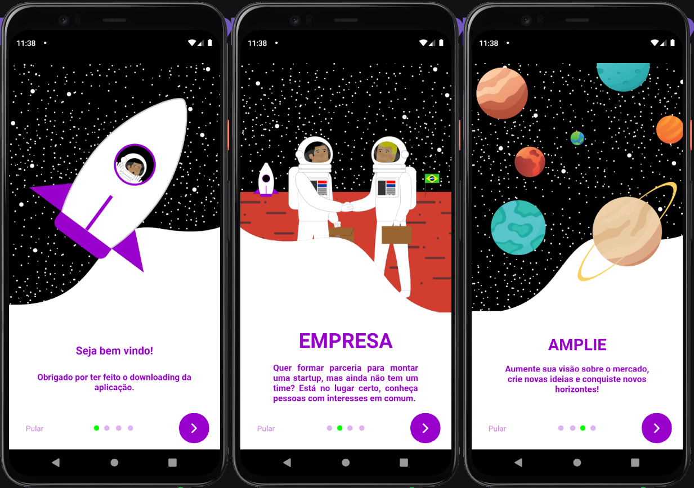
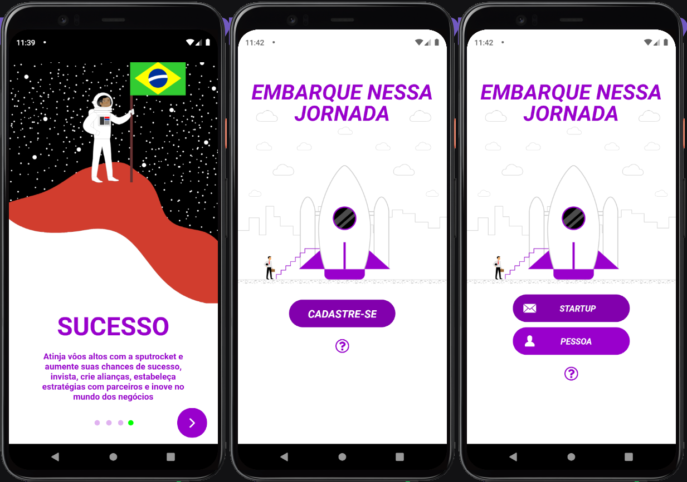
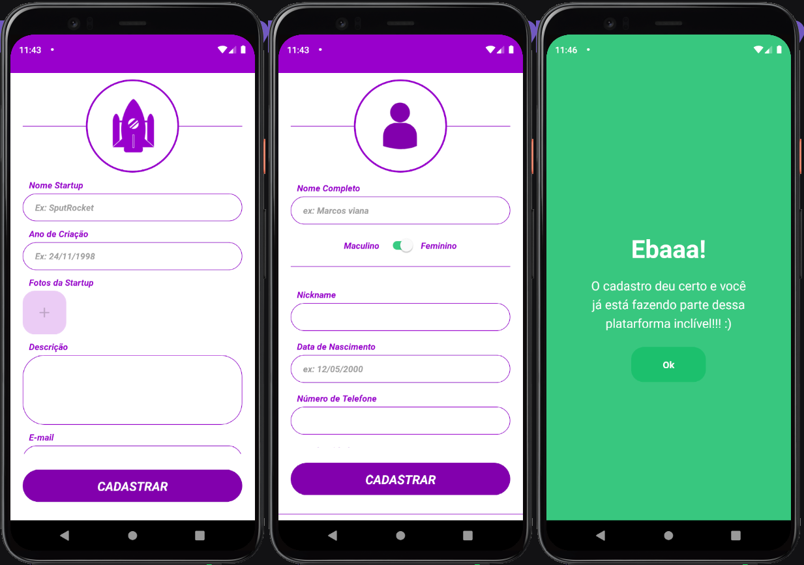

<h1 align="center">
  
</h1>

<p align="center">
  <a href="https://github.com/awlana04">
    
  </a>

  <a href="https://www.linkedin.com/in/helitonoliveira/">
    
  </a>

  <a href="#">
    
  </a>

  <a href="#">
    
  </a>

  
</p>

<p align="center">
  <a href="#rocket-sobre">Sobre</a>&nbsp;&nbsp;&nbsp;|&nbsp;&nbsp;&nbsp;
  <a href="#rocket-sobre">Colaboradores</a>&nbsp;&nbsp;&nbsp;|&nbsp;&nbsp;&nbsp;
  <a href="#rocket-como-inicializar-o-projeto">Como baixar o projeto</a>&nbsp;&nbsp;&nbsp;|&nbsp;&nbsp;&nbsp;
  <a href="#rocket-tecnologias-utilizadas">Tecnologias utilizadas</a>&nbsp;&nbsp;&nbsp;|&nbsp;&nbsp;&nbsp;
  <a href="#pagefacingup-licença">Licença</a>
</p>


<h3>
  
</h3>

<h3>
  
</h3>

<h3>
  
</h3>

## :rocket: Sobre

O **SputRocket** é uma aplicação desenvolvida no Hackathon **Mega Hack 5° Edição - Desafio InovAtiva**, e que tem como objetivo ajudar aqueles que estão começando no mundo do empreededorismo a ir numa jornada a lua. 

E aqueles que já tiraram as ideias do papel, acelerarem seus motores para suas jornadas mais curtas e até as mais longas. Tudo isso de uma forma totalmente cômica e descontraída, e nós não estamos de brincadeira :)

## :rocket: Time

Nós somos o **time 13**, e nosso time é composto pelos integrantes:

- Héliton Oliveira - Dev FullStack
- Awlana Costa - Dev FullStack
- Brendo Saraiva - UX Designer
- Greyson Rampazo - Business

## :rocket: Como inicializar o projeto

Para clonar e rodar a aplicação é preciso ter o [git](https://git-scm.com/), o [node.js](https://nodejs.org/en/) ou o [yarn](https://yarnpkg.com/).

```bash

  # Clonar o repositório

  $ git clone https://github.com/helitonoliveiraa/sputrocket.git

  # Entrar nas pastas necessárias

  $ cd sputrocket

  $ cd backend

  # Instalar as dependências necessárias

  $ yarn

  # Rodar o back-end da aplicação

  $ yarn dev

```

Em outro terminal, caso ainda esteja na pasta **backend** digite:

```bash

  # Para sair e depois entrar na pasta mobile

  $ cd

  $ cd mobile

  $ yarn

  # Inicializar a aplicação

  $ expo start

```

**Caso você utilize o npm é só alterar o yarn por npm.**

Após dá **expo start** uma aba do seu navegador abrirá e lá você poderá escolher se prefere rodar em um emulador de Android ou IOS. Também é possível escolher a opção de ver pelo seu celular ou ainda pela web, o único problema da última opção é que talvez haja alguma feature do expo que não vá poder rodar na web.

## :rocket: Tecnologias utilizadas

O projeto foi desenvolvido nas seguites tecnologias:

- [ReactNative](https://reactnative.dev/)
- [TypeScript](https://www.typescriptlang.org/)
- [Express](https://expressjs.com/pt-br/)
- [TypeORM](https://typeorm.io/)
- [Yup](https://github.com/jquense/yup)
- [Axios](https://github.com/axios/axios)

## :page_facing_up: Licença

Esse projeto está sob a licença MIT. Veja o arquivo [LICENSE](https://github.com/helitonoliveiraa/sputrocket/blob/main/README.md) para mais detalhes.